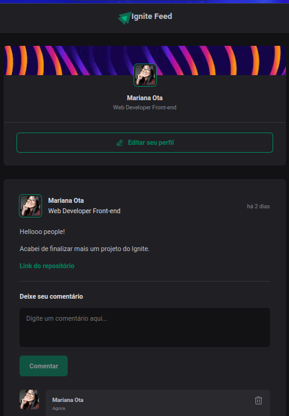
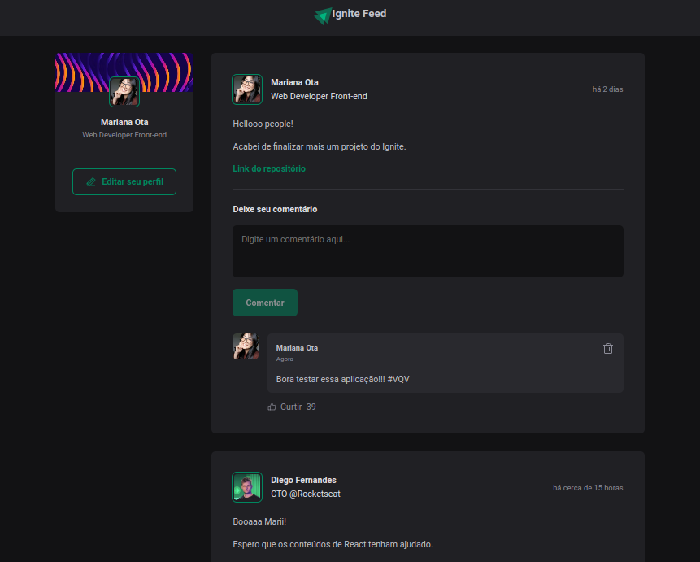

# Página de Feedback do Ignite

<div id='sobre-o-projeto'/>
## 💻 Sobre o projeto 

Uma aplicação web responsiva em React utilizando Vite e Typescript que permite os usuários a comentar, curtir e deletar nos posts publicados.

Nesse primeiro projeto desenvolvido no curso do Ignite da Rocketseat, conceitos importantes como componentização, propriedades, estados, imutabilidade e hooks foram aplicados para reforçar os conhecimentos de forma prática.

---

<div id='funcionalidades'/>
## ⚙️ Funcionalidades 

- [x] Pessoas podem interagir no campo de comentários dos posts:
  - [x] adicionar suas ideias e feedbacks
  - [x] curtir os comentários
  - [x] e deletar os comentários

---

<div id='layout'/>
## 🎨 Layout 

### Mobile

<p align="center">
  
</p>

### Web

<p align="center" style="display: flex; align-items: flex-start; justify-content: center;">
  
</p>

---

## Tabela de conteúdos

<!--ts-->
   * [Sobre o projeto](#sobre-o-projeto)
   * [Funcionalidades](#funcionalidades)
   * [Layout](#layout)
   * [Tabela de Conteudo](#tabela-de-conteudo)
   * [Tecnologias](#tecnologias)
   * [Como usar](#como-usar)
   * [Utilitários](#utilitarios)
   * [Autor](#autor)
   * [Licença](#licenca)
<!--te-->

---

## 🛠 Tecnologias
<div id='tecnologias'/> 

As seguintes ferramentas foram usadas na construção do projeto:

- [React](https://pt-br.reactjs.org/)
- [TypeScript](https://www.typescriptlang.org/)

---

## 🧭 Como usar - Rodando a aplicação web (Frontend)
<div id='como-usar'/> 

```bash

# Clone este repositório
$ git clone git@github.com:ota-mariana/comments-page-ts-version.git

# Acesse a pasta do projeto no seu terminal/cmd
$ cd comments-page-ts-version

# Instale as dependências
$ npm install

# Execute a aplicação em modo de desenvolvimento
$ npm run dev

# A aplicação será aberta na porta:5173 - acesse http://localhost:5173

```

---


#### Utilitários
<div id='utilitarios'/> 

-   Protótipo:  **[Figma](https://www.figma.com/community/file/1113573231685349036)**
-   Editor:  **[Visual Studio Code](https://code.visualstudio.com/)**
-   Commit Conventional:  **[Commitlint](https://github.com/conventional-changelog/commitlint)**
-   Ícones:  **[Phosphor](https://phosphoricons.com/)**
-   Fontes:  **[Roboto](https://fonts.google.com/specimen/Roboto)**

---

## 🦸 Autor
<div id='autor'/> 


<br />
<p>Mariana Naomi Ota</p>

---

## 📝 Licença
<div id='licenca'/> 

Este projeto esta sobe a licença [MIT](./LICENSE).

Feito com ❤️ por Mariana Ota 
